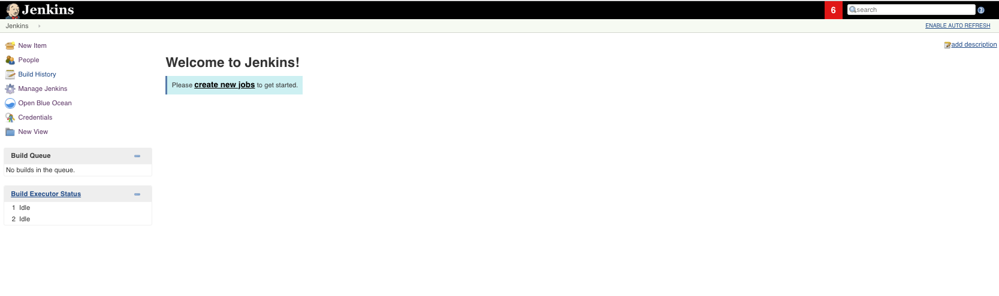

== Environment Preparation

In this section, you will be deploying all of the DevOps tools that we
will be using throughout this tutorial. The following table lists each
tool that will be used and their general purpose.

.DevOps Tooling
[cols=",",options="header",]
|===
|Tool |Description
|https://docs.docker.com/registry/[(Insecure) Docker Registry]
|Container Image Registry used to store and retrieve Docker images

|https://jenkins.io/[Jenkins] |An open-source CI/CD server used to
execute the pipeline

|https://www.sonarqube.org/about/[SonarQube Server] |A static code
analysis tool used to scan code for potential security vulnerabilities,
bugs, and code smells
|===

[NOTE]
====
The tools that we will be utilizing throughout this tutorial are not
fully secure or highly available and thus *not production-ready*. Their
configuration in this lab is meant strictly for local development to try
out SDP.
====
=== Step 1: Register The Insecure Docker Registry

To push and pull images from the local registry to be deployed, you'll
need to register it as an insecure registry on your machine. Modify your
docker preferences to add `0.0.0.0:5000` as an insecure registry.

Follow the instructions under the section labeled "Deploy a plain HTTP
registry" found
https://docs.docker.com/registry/insecure/#deploy-a-plain-http-registry[here].

[NOTE]
.Note
====
The URL of the Docker registry should *not* be preceded by `http://`
when being added to the list of insecure registries.
====
Make sure to apply the changes and restart your docker daemon in
order for these changes to take effect.

=== Step 2: Clone the Learning Labs Repository Application

To begin, clone our https://github.com/boozallen/sdp-labs[SDP Learning
Labs] GitHub repository, which includes all of the files you'll need to
use throughout this lab.

[source,bash]
----
## cloning via ssh
git clone git@github.com:boozallen/sdp-labs.git

## cloning via https
git clone https://github.com/boozallen/sdp-labs.git
----

In your terminal, navigate to the `sdp-labs` directory that you just
cloned from GitHub.

=== Step 3: Deploy The Tools

We'll be using https://docs.docker.com/compose/[docker compose] to
deploy these tools locally.

Run the following command in your terminal from the root directory of
the `sdp-labs` repository to deploy the Docker containers using the
provided docker-compose.yaml file within the `try-it-out` directory.

[source,bash]
----
docker-compose -f ./try-it-out/docker-compose.yaml up --build -d --scale sonar-scanner=0
----

[NOTE]
====
The `docker-compose` command run above may not work on Booz Allen's WiFi
depending on its firewall settings, so you may need to run it on a
private network or where firewall rules are more lax.
====
The above command will create and run the following Docker
containers: Jenkins, a Docker registry, and SonarQube.

=== Step 4: Validate the Deployment

Let's verify that each tool was successfully deployed.

*Docker Registry*

[verse]
--
Navigate http://localhost:5000/v2/_catalog[here].
You should see the following screen:
--

image:../images/deploy-devops-tools/docker_registry.png[image]

*Jenkins*

[verse]
--
Navigate http://localhost:8080[here].
You should see the following screen:
--

*SonarQube Server*

[verse]
--
Navigate http://localhost:9000[here].
You should see the following screen:
--

image:../images/deploy-devops-tools/sonarqube.png[image]

[IMPORTANT]
====
If any of these services are not working as expected you can check out
the `troubleshooting <try-it-out troubleshooting>` page for common
problems and their fixes.
====
