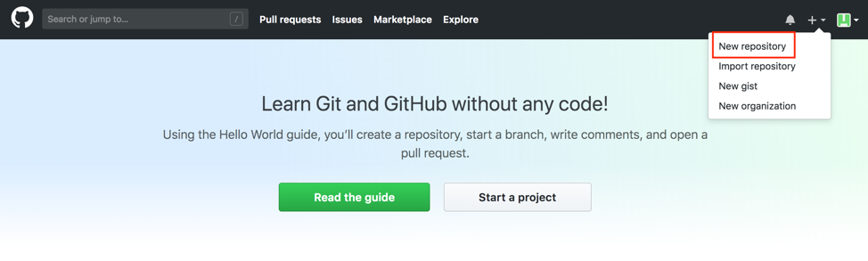

.. _Create Git Repository for a Pipeline Configuration:

-------------------------------------------------------
Create a GitHub Repository for a Pipeline Configuration
-------------------------------------------------------

In this step, you will be creating a GitHub repository that has a pipeline configuration within it. 

The **Pipeline Configuration Repository** is a Git repository where organization-wide settings are configured for your DevSecOps pipelines.
This repository will contain your business organization or project’s configuration file, which specifies the organization-wide libraries you’d like to utilize within the platform, the application environments, your pipeline templates, and more. 

For this example, you will be configuring a pipeline configuration repository that will be able to perform static quality analysis on a tool called SonarQube and to build a Docker image if the given code reaches a certain code quality based on the analysis.

While this example of a pipeline configuration only uses two software tools (Docker and SonarQube), there are many other tools that have been already integrated with SDP. For more information about the libraries that have already been integrated with SDP, go here:

.. code-block:: bash

    https://boozallen.github.io/sdp-pipeline-framework/pages/libraries/index.html

==========================
Create a GitHub Repository
==========================

To start, open up a new tab on your browser and then navigate to https://github.com/.

After signing in using your GitHub credentials, you will first create a new repository by going to the upper-hand corner of the screen and clicking the **plus symbol**.
Click the **New repository** option to start creating a repository.

You should now be taken to a screen to **Create a new repository**.
For the repository name, let’s just call it **pipeline-configuration**.
The name of the repository itself is arbitrary, though this name will be referenced in the next section when you specify the settings for your Jenkins pipeline.

You can make it either public or private depending on if you want this repository to be available to the general public.
Do not check the checkbox to initialize the GitHub repository with a README, as you be creating a directory with the right files to push to Git in your computer’s terminal.
You can add a **.gitignore** file if you want and give it the license type you’d like your project to have.

After doing so, you can now click **Create repository**.

You should be taken to a screen describing how you can upload files from your local computer to the GitHub repository.
As you haven’t created any files for the pipeline-configuration repository yet, let’s start there.

======================================
Create the Pipeline Configuration File
======================================

Choose a location for your project files, and create a new directory called **pipeline-configuration**.

In a text editor, create a file within the pipeline-configuration directory called **pipeline_config.groovy** with the following content:

.. code-block:: bash

    libraries{
      sdp{
        images{
          registry = "http://localhost:5000" // registry url
          cred = "sdp-docker-registry"// jenkins cred id to authenticate
          repo = "sdp"       // repo to find sdp images -> currently hard coded as "sdp"
          docker_args = "--network=try-it-out_sdp"  // docker runtime args
        }
      }
      github_enterprise
      sonarqube{
        enforce_quality_gate = true
      }
      docker{
       registry = "localhost:5000"
       cred = "sdp-docker-registry"
      }
    }

.. note:: You may need to change the IP Address of the ``registry`` and ``application_image_repository`` values depending on what it is for your docker registry.

The pipeline_config.groovy file are a big part what allows SDP to do something special: 
it allows for easy pipeline reuse by different application repositories. While it’s not explained in this tutorial, 
you may want to look at defining stage within your pipeline_config.groovy file to group together different library steps 
in a specific order that can easily be called by your applications’ different Jenkinsfiles, as described on this page: https://boozallen.github.io/sdp-pipeline-framework/pages/for-sdp-users/conditional-inheritance.html

This file has several parts to it.
In general, it consists of configuring some parameters for the local Docker registry URLs and their respective credentials that you will be using later in this guide as well as specifying all the libraries that you will be using.

The ``application_image_repository`` URL defined within the given pipeline_config.groovy file specifies the Docker registry where Docker images will be pushed to while the respective credential key specifies the Jenkins credentials (which we have already automated the creation of within the Jenkins instance) needed for Jenkins to be able to access your given Docker registry. 
In this example, the local Docker registry we setup earlier is where application Docker images will be pushed to.
For more information about the **application_image_repository** key-value pairs, visit this page: https://boozallen.github.io/sdp-pipeline-framework/pages/for-sdp-users/app-image-repo.html

The values defined within the ``libraries.sdp.images`` block defines some parameters of how SDP-related Docker images will be handled. The registry value specifies the URL for where SDP Docker images will be pulled from using the local Docker registry you already setup while the ``cred`` field specifies the ID of the Jenkins credential used to access it.
The ``docker_args`` field allows for users to enter any Docker flags they want to use to run SDP-related Docker images, as shown by the ``--network=try-it-out_sdp`` specified, which ensures that a SDP-specific Docker container will be put in a `Docker network`_ labeled "try-it-out_sdp."

.. _Docker network: https://docs.docker.com/v17.09/engine/userguide/networking/#user-defined-networks

In the section enclosed by **libraries**, we declare each of the libraries that we’d like to use within our pipeline and set any parameters that we need to set for the respective library.
As there are no mandatory library configuration options you need to set for the Docker library, you can leave it blank.
However, in the sonarqube stage, we set the **enforce_quality_gate** boolean variable to be true so that the Jenkins build will fail if the code does not pass the quality gate, or some general code quality percentage, which is configurable in SonarQube itself.

For more information about the Docker and Sonarqube libraries, you can go here:
    * Docker: https://boozallen.github.io/sdp-pipeline-framework/pages/libraries/docker.html
    * SonarQube: https://boozallen.github.io/sdp-pipeline-framework/pages/libraries/sonarqube.html

For a list of all the libraries that have already been integrated with SDP in general, you can visit our libraries page `here`_.

.. _here: https://pages.github.boozallencsn.com/solutions-delivery-platform/pipeline-framework/pages/libraries/

When you’re done creating the pipeline_config.groovy file and saving it to the pipeline-configuration directory, you will now push the files to the GitHub repository you made in the previous step.

For more information about what you can do within pipeline-configuration files, take a look at the different sub-sections under the "For SDP Users" section: https://boozallen.github.io/sdp-pipeline-framework/pages/for-sdp-users/index.html

===================================
Pushing Code to a GitHub Repository
===================================

In your terminal, navigate to the inside of your pipeline-configuration directory, which should now only contain a **pipeine_config.groovy** file.
Afterwards, enter the following commands into your terminal to push the contents of that directory (which should only consist of the pipeline_config.groovy file) to the GitHub repository.

.. code-block:: bash

    echo "# pipeline-configuration" >> README.md
    git init
    git add .
    git commit -m "first commit"
    git remote add origin https://github.com/organization-name/pipeline-configuration.git
    git push -u origin master

.. note:: Make sure that you replace **organization-name** within the github URL with the name of your `GitHub organization`_ or, more likely, the username of your GitHub account if that's where you created the GitHub Organization earlier in this page.

.. _GitHub Organization: https://help.github.com/articles/about-organizations/

If you refresh your browser with the GitHub tab still open, you should see something similar to the screenshot shown below:

.. image:: ../images/create-repository-for-pipeline-config/view_github.png

You now have a GitHub repository to configure a pipeline that you can use to build out pipelines for the Spring Boot API!