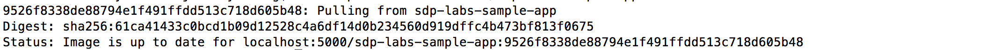

[[Run Jenkins Build]]
== Run the Jenkins Build

You've now done everything you needed to run the Jenkins build! Without
further ado, let's actually run it and see what it can do.

Navigate to the general menu for the Jenkins pipeline of the sample code
applications at
http://localhost:8080/job/sample-spring-boot-api/job/master/.

On the left-hand side, click *Build Now*. Afterwards, refresh the page
and you should see a new build that is building. Click on the number for
that new build and on the page that appears, click *Console Output*.

You can view the logs to see what is happening when it comes to how
Jenkins is interacting with the different tools you've deployed.

Jenkins does the following in the list as ordered:

____
[arabic]
. Retrieves the
https://github.com/boozallen/sdp-labs-sample-app/blob/master/pipeline_config.groovy[pipeline_config.groovy]
file from the
https://github.com/boozallen/sdp-labs-sample-app.git[sample application
GitHub repository]
. Retrieves and loads the SDP libraries listed in the
https://github.com/boozallen/sdp-labs-sample-app/blob/master/pipeline_config.groovy[pipeline_config.groovy]
file from the https://github.com/boozallen/sdp-libraries[SDP-Libraries
repository]
. Retrieves the code of the sample code application and loads it within
the file system inside the Jenkins Docker container
. Retrieves the
https://github.com/boozallen/sdp-labs-sample-app/blob/master/Jenkinsfile[Jenkinsfile]
from the https://github.com/boozallen/sdp-labs-sample-app.git[sample
application GitHub repository]
. Runs the `static_code_analysis` step from the
https://github.com/boozallen/sdp-labs-sample-app/blob/master/Jenkinsfile[Jenkinsfile]
to perform some code analysis on the sample code application using
SonarQube
. Waits for a notification from the SonarQube server that the code
analysis is complete
. Runs the `build` step from the
https://github.com/boozallen/sdp-labs-sample-app/blob/master/Jenkinsfile[Jenkinsfile]
to build a Docker image for the code from
https://github.com/boozallen/sdp-labs-sample-app.git[sample application
GitHub repository] using the repository's
https://github.com/boozallen/sdp-labs-sample-app/blob/master/Dockerfile[Dockerfile]
. Pushes the Docker image built from step 7 to your local Docker
registry located at http://localhost:5000
____

Once the build is complete, you should see the following text at the
bottom of the screen:

[source,bash]
----
Finished: SUCCESS
----

Now that the build is done, you can now see the results of your build in
the next few sections. Keep this page open for the next section.

=== Verify that the Docker Image was Pushed

In this section, you will be pulling the Docker image from the local
repository to verify that a Docker image for the sample code application
was pushed to your local Docker registry.

From the logs of the Console Output, find the text
`Successfully tagged localhost:5000/sdp-labs-sample-app` on the page.

Copy the entire line of where you found it including everything that
follows the word `app`, so it would include a colon and a series of
seemingly random letters and numbers. An example is as follows:

image:../images/run-jenkins-build/docker_tag.png[image]

Paste the content into your terminal.

[NOTE]
.Note
====
The series of letters and numbers make up the
https://help.github.com/articles/github-glossary/[Git SHA] (the unique
ID) of the latest commit for the sample code application's GitHub
repository.
====For the text that you just pasted into your terminal, remove the
text `Successfully tagged` and replace it with `docker pull`. An example
of the command using the above image would be:

[source,bash]
----
docker pull localhost:5000/sdp-labs-sample-app:9526f8338de88794e1f491ffdd513c718d605b48
----

Run the command and verify that you get a response similar to the
following:

=== View the SonarQube Report

In your browser, navigate to the user interface for your local SonarQube
instance at http://localhost:9000.

If you're not already logged into SonarQube, click *Log in*. The
username and password will both be `admin`, as it's the default
SonarQube credentials. Click *log in* on the popup when you're done
entering them.

On your screen, you should now see the following:

image:../images/run-jenkins-build/sonarqube_projects.png[image]

Click the `sdp-labs-sample-app - masterPassed` text, which links the
report of the various issues that SonarQube found when doing the code
analysis for our sample application code.

Congratulations on creating your first Jenkins pipeline using the
Solutions Delivery Platform!
